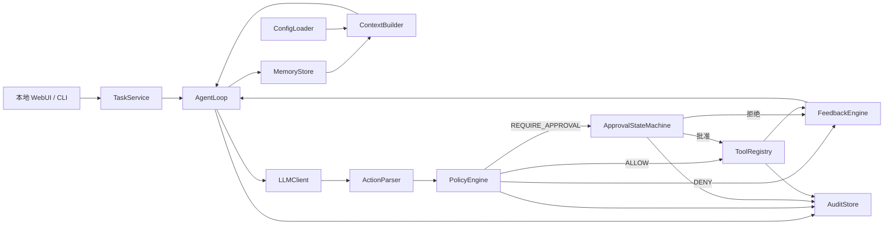

# SafeFix Harness 产品与技术规约

- 状态：待书面审核
- 日期：2026-07-13
- 项目类型：AI4SE Final Project A · Coding Agent Harness
- 主开发智能体：OpenAI Codex App + Superpowers

## 1. 问题陈述

个人开发者常会遇到范围明确但处理过程重复的小型代码缺陷：定位相关文件、进行局部修改、运行测试、阅读失败信息并继续修正。通用编码智能体虽然能提出修改，但若缺少确定性的工具边界、测试反馈、停机条件和人工审批，可能执行越界读写、危险命令或无效的无限重试。

SafeFix Harness 面向在本地代码库工作的个人开发者。用户提供项目目录和缺陷描述，SafeFix 在受限工作区内读取与修改代码，运行声明式配置的验证命令，根据客观失败信号最多自动修正三轮，并在危险动作前暂停等待人工决定。

项目价值不在于训练新的模型，而在于自行实现一个可验证的 coding-agent harness：模型只负责提出下一步动作，循环、工具、上下文、记忆、治理、反馈和配置均由本项目代码控制。

## 2. 目标与非目标

### 2.1 目标

1. 自行实现完整 Agent 主循环，不依赖现成 agent runner。
2. 支持本地 WebUI 与 CLI 两种入口，共用同一 harness 内核。
3. 为个人本地代码库提供安全的小型缺陷修复闭环。
4. 以治理护栏为主要贡献，深入实现路径围栏、风险分级、HITL 状态机和审计。
5. 以测试、lint、类型检查作为确定性反馈信号，驱动最多三轮自我修正。
6. 所有核心机制都能在 scripted mock LLM 下离线、确定性测试。
7. 提供不接触真实代码和 API Key 的公网交互演示。

### 2.2 非目标

- 不实现通用自主软件工程平台、需求管理或多 Agent 协作平台。
- 不自动发布、部署或推送用户代码。
- 不保证修复任意规模、任意语言的缺陷。
- 不提供云端真实代码上传和真实 LLM 执行。
- 不把 LangChain AgentExecutor、AutoGen、CrewAI、LlamaIndex Agent 或宿主编码智能体循环作为产品内核。

## 3. 用户故事

1. 作为个人开发者，我希望指定一个本地项目和缺陷描述，以便让 SafeFix 在该项目边界内尝试修复。
2. 作为个人开发者，我希望看到 Agent 的动作、文件差异和验证结果，以便理解其行为而不是盲目信任结果。
3. 作为谨慎的开发者，我希望危险操作在执行前展示风险、命中规则和精确参数，以便批准或拒绝该次操作。
4. 作为个人开发者，我希望测试失败能自动反馈给 Agent 并触发有限重试，以便减少手工往返。
5. 作为项目维护者，我希望用 YAML 声明验证命令和安全边界，以便针对不同语言项目复用同一 harness。
6. 作为重复使用者，我希望 SafeFix 记住项目约定和已确认决策，并只检索当前任务相关内容，以便减少重复说明。
7. 作为 API Key 所有者，我希望通过隐藏输入安全保存、查看配置状态、更新和清除 Key，以便凭据不进入源码或日志。
8. 作为课程评审者，我希望在公网 WebUI 和离线 demo 中稳定复现拦截、反馈修正和审批恢复，以便客观验证核心机制。

这些故事彼此独立、具有用户价值，可分别测试，范围足够小且拥有明确验收条件，符合 INVEST 原则。

## 4. 功能规约

### 4.1 任务创建与运行

- 输入：项目根目录、自然语言缺陷描述、可选配置文件。
- 行为：校验工作区和配置，创建唯一运行 ID，加载有限记忆并进入 AgentLoop。
- 输出：运行状态、动作时间线、验证结果、变更文件和终止原因。
- 边界：本地任务必须指向现有目录；公网任务只能使用内置示例项目。
- 错误处理：目录不存在、配置非法或凭据缺失时在首次 LLM 调用前失败，不产生代码修改。

### 4.2 决策封装与 Agent 主循环

- 输入：任务、当前状态、相关记忆、最近工具结果和剩余预算。
- 行为：构建上下文，调用一次 LLM，解析一个结构化动作，交由策略引擎判定，再执行或暂停；结果回灌后开始下一轮。
- 输出：下一状态、事件记录以及必要的工具或反馈结果。
- 边界：每轮只允许一个动作；最多三轮修复，并受总步骤、时间和输出预算约束。
- 错误处理：模型输出不符合 Schema 时产生 `INVALID_ACTION` 反馈；连续无法解析时以 `FAILED` 停止。

### 4.3 LLM 抽象

- 接口：`complete(messages, settings) -> ModelResponse`。
- 实现：`OpenAICompatibleClient` 执行单次对话请求；`ScriptedMockLLM` 按预设序列返回结果。
- 边界：LLMClient 不包含循环、工具执行、审批或记忆逻辑。
- 错误处理：超时、限流和供应商错误转换成结构化错误，不把请求头或 Key写入日志。

### 4.4 动作与工具

支持以下结构化动作：

- `list_files`：在工作区内列出受数量限制的文件。
- `read_file`：读取工作区内非敏感文件的限定行或字节范围。
- `search_text`：按模式搜索并限制匹配数和输出量。
- `apply_patch`：对指定文件应用带预期文件摘要的补丁，防止基于陈旧内容覆盖。
- `run_validation`：按配置 ID 运行测试、lint 或类型检查。
- `run_process`：以 `program + args` 请求额外进程，必须经过风险判定。
- `finish`：声明完成并触发最终验证。

所有工具统一返回 `ToolResult`：成功标记、退出码、标准输出摘要、标准错误摘要、变更文件、耗时和错误类型。工具不得直接调用 LLM 或绕过 PolicyEngine。

### 4.5 治理护栏

- 路径先规范化为绝对路径，再验证其位于项目根目录。
- 拒绝路径穿越、工作区外绝对路径和解析后越界的符号链接。
- `AccessKind` 明确区分 READ、WRITE、LIST、SEARCH；Windows 比较使用规范绝对路径、`normcase` 与 `commonpath`，不同盘符直接视为越界。
- 默认禁止读取 `.env`、私钥、凭据目录和配置定义的敏感模式；模式统一采用 pathspec 的 GitWildMatch 语义并对工作区相对 POSIX 路径匹配。
- `run_process` 使用非 Shell 子进程模式；输入为程序和参数数组，不接受管道、重定向、命令替换或拼接 Shell 字符串。
- 策略决定只有 `ALLOW`、`REQUIRE_APPROVAL`、`DENY` 三种。
- 工作区内受控读写及预配置验证命令可自动允许。
- 删除、安装依赖、网络工具、Git 写操作和未配置程序必须审批。
- 越界访问、提权、读取凭据和系统破坏动作永久禁止。

审批时保存动作摘要、动作哈希、风险等级、规则编号和原因。批准只能执行冻结的原动作；一次性审批令牌不能重放。拒绝会作为人工反馈回灌。超时或取消使任务停止。

### 4.6 客观反馈闭环

- 验证器由配置声明程序、参数、超时、成功退出码和输出上限。
- 每次修改后运行适用验证器；`finish` 前必须运行最终验证。
- 反馈分类为测试失败、lint 失败、类型错误、超时、工具错误或策略拒绝。
- 失败反馈包含失败用例、关键错误、退出码、本轮变更文件和剩余预算。
- 对规范化失败结果生成指纹。失败数下降或指纹有效变化视为进展。
- 连续两轮无进展、重复相同动作或达到预算时确定性停止。

### 4.7 记忆

- SQLite 按项目保存项目约定、人工确认决策、任务摘要和常见失败。
- 检索按项目、类型、关键词相似度和时间衰减计算相关度。
- 每轮只加载排名靠前且不超过字符预算的记录。
- 不长期保存完整对话、完整测试日志或任何 API Key。
- WebUI 与 CLI 支持查看和清除项目记忆。

### 4.8 配置

`safefix.yaml` 声明：

- 项目标识与工作区规则；
- 验证器及其结构化命令；
- 自动允许的程序与参数约束；
- 敏感路径模式；
- 最大轮数、步骤数、时间、输出量和记忆量；
- LLM endpoint 与模型名，但不包含 Key。

配置使用严格 Schema 校验。未知字段、非法命令、重复 ID 或矛盾规则在任务开始前返回定位明确的错误。

### 4.9 凭据管理

- `credentials set` 使用隐藏输入写入操作系统 Keyring。
- `credentials status` 仅返回是否已配置及供应商，不显示明文。
- `credentials clear` 删除对应凭据；再次运行真实模型任务时重新引导录入。
- 可选真实模型模式只从操作系统 Keyring 或显式只读 secret 文件获取凭据；不把 `.env` 作为推荐来源。
- 所有日志、异常、审计、记忆和 Web API 响应在输出前脱敏。

### 4.10 WebUI 与 CLI

本地 WebUI 提供任务创建、运行时间线、文件差异、验证结果、审批、设置和记忆管理。CLI 提供：

```text
safefix run <project> --task <description>
safefix serve
safefix config init
safefix config validate
safefix credentials set|status|clear
safefix demo
```

公网 WebUI 使用 mock LLM 和内置临时示例仓库，不接收真实代码、项目路径或 API Key，不允许网络和任意程序。

### 4.11 审计

- 记录任务、动作、策略决定、命中规则、审批、工具结果和终止原因。
- 事件在持久化前脱敏，并包含运行 ID、序号和时间戳。
- 每条事件保存前一事件哈希，形成可验证的哈希链。
- 审计失败时采取 fail-closed：危险动作不得在缺少审计记录的情况下执行。

## 5. 领域与机制设计

### 5.1 所需工具

Coding 场景需要文件列举、读取、搜索、局部修改、验证命令和受治理的额外进程。工具由本项目代码实现和分发，LLM 只能请求结构化动作。

### 5.2 客观反馈信号

测试、lint、类型检查的退出码与解析结果是主要反馈信号。FeedbackEngine 是确定性传感器：它运行验证器、解析结果、分类失败、计算指纹和进展，再把结构化结果送回 AgentLoop。该机制不依赖 LLM 自我评价。

### 5.3 危险动作

删除、安装、联网、Git 写操作和非预配置进程需要审批；越界、提权、凭据读取和系统破坏永久禁止。PolicyEngine、路径围栏和 ApprovalStateMachine 共同编码实现，不能被系统提示词替代。

### 5.4 记忆需求

跨会话只保留项目约定、人工决策、任务摘要和失败经验。检索与预算由本项目代码控制，不调用框架内置 memory。

### 5.5 重点维度

主角维度为治理。除三级风险模型外，深入实现规范化路径围栏、敏感路径、结构化命令、规则解释、冻结动作哈希、单次审批令牌、持久化暂停/恢复和防篡改审计链。其确定性行为在 mock LLM 和直接构造 Action 的测试中验证。

## 6. 非功能性需求

### 6.1 安全

- 对来自 LLM、仓库内容和用户配置的输入默认不信任。
- 策略判定不依赖提示词遵从。
- 真实 Key 不进入仓库、数据库、日志、终端参数或公网演示。
- 公网演示每个会话使用独立临时目录，只开放内置工具，并限制执行时间、步骤、输出和请求频率。
- 默认在持久化隔离副本中运行；真实模型模式只为 LLM HTTP 请求开放网络，额外网络程序仍由策略拦截或审批。

### 6.2 性能与资源

- 除 LLM 和外部验证器外，本地 API 的普通状态查询应在 200 ms 内响应。
- 所有文件读取、搜索、进程和模型输出都有大小或时间上限。
- 单次任务默认最多三轮修复；预算可在允许范围内配置。

### 6.3 可用性

- 错误信息必须说明失败阶段、客观原因和可执行的下一步。
- WebUI 与 CLI 展示相同的运行状态和审批语义。
- 用户可安全取消任务；取消后不继续执行排队动作。

### 6.4 可观测性

- 使用结构化本地日志和审计事件，包含 run ID 与 event ID。
- 默认不上传遥测。
- 日志级别可配置，但任何级别都必须经过脱敏。

### 6.5 可测试性

- 所有核心接口支持依赖注入。
- 核心单测不访问网络、不需要真实 Key、结果可重复。
- AgentLoop、工具、治理、反馈、记忆、配置和停机均有独立测试。

## 7. 系统架构与数据流



一次正常运行的数据流为：校验配置与凭据 → 创建运行 → 检索相关记忆 → 构建上下文 → 单次 LLM 调用 → 动作解析 → 治理判定 → 执行/审批/拒绝 → 运行验证 → 反馈回灌 → 判断继续或停机 → 保存摘要与审计。

## 8. 主要数据模型

### Task

- `id`、`project_id`、`workspace_root`、`description`
- `mode`：`local` 或 `public-demo`
- `created_at`

### Action

Action 使用判别联合而非通用 `payload`。所有动作都有非空 `id`、非空 `reason` 和带默认值的 `type`；时间戳属于审计事件，动作哈希由 `action_digest(action)` 计算，不作为可由 LLM 提供的字段。

| 动作 | `type` | 专属字段与约束 |
|---|---|---|
| `ListFilesAction` | `list_files` | `path="."`；`pattern="**/*"`；`limit=100`，范围 1–1000 |
| `ReadFileAction` | `read_file` | 非空 `path`；`start_line=1`；`end_line=200`；起始行至少为 1、结束行不得小于起始行、单次最多 500 行 |
| `SearchTextAction` | `search_text` | 非空 `pattern`，按字面文本匹配、最长 512 字符；`path="."`；`file_glob="**/*"`；`max_results=50`，范围 1–200 |
| `ApplyPatchAction` | `apply_patch` | 非空 `path`；64 位小写十六进制 `expected_sha256`；非空 `old_text`；`new_text`；`expected_replacements=1`，范围 1–100 |
| `RunValidationAction` | `run_validation` | 非空 `validator_id` |
| `RunProcessAction` | `run_process` | 非空且去除首尾空白的 `program`；`args` 为字符串元组且允许为空 |
| `FinishAction` | `finish` | 非空 `summary` |

所有模型 `extra="forbid"` 且不可变。字符串形式的 `type` 必须与表中值完全一致。

### Enums

- `DecisionOutcome`：`ALLOW`、`REQUIRE_APPROVAL`、`DENY`。
- `RiskLevel`：`LOW`、`MEDIUM`、`HIGH`，分别对应默认自动允许、需要审批、永久禁止的风险级别。
- `RunStatus`：`CREATED`、`RUNNING`、`AWAITING_APPROVAL`、`SUCCESS`、`BLOCKED`、`NO_PROGRESS`、`BUDGET_EXCEEDED`、`FAILED`、`CANCELLED`。
- `FeedbackCategory`：`VALIDATION_SUCCESS`、`TEST_FAILURE`、`LINT_FAILURE`、`TYPE_ERROR`、`TIMEOUT`、`TOOL_ERROR`、`POLICY_REJECTION`。
- `ApprovalStatus`：`PENDING`、`APPROVED`、`REJECTED`、`EXPIRED`、`CANCELLED`。
- `AccessKind`：`READ`、`WRITE`、`LIST`、`SEARCH`。
- `TaskMode`：`local`、`public-demo`。

### BudgetState

- `max_steps`、`remaining_steps`：最大值至少为 1，剩余值至少为 0 且不得超过最大值。
- `max_repair_rounds`、`remaining_repairs`：最大值至少为 1，剩余值至少为 0 且不得超过最大值。
- `deadline_at`：可选 UTC 时间戳。

### RunSnapshot

- `run_id`、`task_id`、`project_id`、`workspace_root`、`description`。
- `status`、`repair_round`、`step_count`、`budget`、`version`。
- `pending_approval_id`、`latest_tool_result`、`stop_reason` 可为空。
- `action_digests`、`feedback_history`、`changed_files` 为不可变元组。
- `created_at`、`updated_at` 为 UTC 时间戳。

### PolicyDecision

- `action_id`、`outcome`
- `risk_level`、`rule_ids`、`explanation`

### ApprovalRequest

- `id`、`run_id`、`action_hash`
- `status`、`one_time_token_hash`、`frozen_action_json`
- `created_at`、`expires_at`、`decided_at`

### ToolResult

- `action_id`、`success`、`exit_code`
- `stdout_summary`、`stderr_summary`
- `changed_files`、`duration_ms`、`error_type`

`exit_code` 和 `error_type` 可为空；输出摘要默认为空字符串，变更文件默认为空元组。`ToolResult.failure(action_id, error_type, message)` 是标准失败构造器，返回 `success=false` 且不抛出一般工具错误。

### Feedback

- `category`、`summary`、`failure_count`
- `fingerprint`、`remaining_steps`、`remaining_repairs`、`changed_files`

进展不直接存为 Feedback 字段。`ProgressResult` 包含 `made_progress` 与 `reason`；`StopDecision` 包含稳定的 `code` 与 `reason`。

### MemoryRecord

- `id`、`project_id`、`type`、`content`
- `keywords`、`created_at`、`last_used_at`

### AuditEvent

- `run_id`、`sequence`、`event_type`、`redacted_payload`
- `previous_hash`、`event_hash`、`created_at`

## 9. 凭据威胁模型与对策

| 威胁 | 对策 |
|---|---|
| Key 被硬编码或提交 | Keyring/secret file；`.gitignore`；CI 凭据扫描 |
| Key 出现在终端历史 | 使用交互式隐藏输入，不通过命令参数录入 |
| Key 泄漏到日志或异常 | 集中脱敏器；日志与 API 响应测试 |
| 仓库内容诱导读取密钥 | 敏感路径永久禁止；策略独立于提示词 |
| 路径穿越或符号链接逃逸 | 规范化路径与真实目标校验 |
| Shell 注入 | 结构化 `program + args`；`shell=False`；拒绝 Shell 语法 |
| 审批后动作被替换 | 冻结动作哈希与一次性令牌 |
| 公网任意代码执行 | 仅内置仓库和 mock；禁用网络与任意程序；临时目录及资源限制 |
| 同一 OS 用户窃取 Keyring | 明示 Keyring 依赖操作系统账户安全；不声称抵御已攻陷账户 |

## 10. 技术选型与理由

- Python 3.12：适合快速实现可测试的编排、文件与子进程机制。
- FastAPI：提供类型化本地/公网 API 和自动化接口测试。
- 服务端 HTML 模板与少量 JavaScript：降低前端构建复杂度；实现时遵循 Open Design 规范。
- Pydantic：严格验证动作和 YAML 配置 Schema。
- pathspec：以明确的 GitWildMatch 语义匹配敏感路径和忽略规则，避免不同 glob API 的行为差异。
- SQLite：零运维存储运行、审批、审计和记忆。
- pytest + Hypothesis：确定性单测、集成测试及路径/命令属性测试。
- keyring：对接 Windows Credential Manager 等操作系统凭据库。
- httpx：实现 OpenAI-compatible 单次 HTTP 调用。
- Hatchling wheel：提供可复现安装包和 CLI Release 资产。

第三方组件只作为 HTTP、解析、存储和测试等底层零件，不提供 Agent 主循环或高层治理。

## 11. 分发设计

- 目标平台：Windows 10/11 与 Linux 的 Python 3.12 环境。
- Python 包：提供安装和 CLI 入口，真实 Key 默认保存到 OS Keyring。
- 演示：CLI Release 是最终分发入口；本地 WebUI 只运行内置 public-demo Mock，不依赖公网部署。
- README 必须说明安装、运行、目录结构、分发、安全边界、Key 配置和已知限制。
- CI 同时提供 `.gitlab-ci.yml` 的 `unit-test` job 与 GitHub Actions；最终流水线必须通过。

## 12. 验收标准

1. mock LLM 能驱动完整 AgentLoop，且测试无网络依赖。
2. 直接构造危险 Action 时，PolicyEngine 稳定返回审批或拒绝，工具不会提前执行。
3. 越界路径、符号链接逃逸和敏感文件读取均被拒绝。
4. mock 首轮错误补丁导致测试失败；反馈进入下一轮；第二轮动作不同且最终测试通过。
5. 审批状态可持久化恢复；动作参数不可替换；令牌不能重放。
6. 连续两轮无进展、重复动作和预算耗尽分别触发对应停机状态。
7. SQLite 记忆按项目隔离，只返回数量和字符预算内的相关记录。
8. Key 可隐藏录入、查看状态、更新和清除，且不会出现在日志、数据库或 Git。
9. 本地 WebUI 与 CLI 能运行内置 Python 示例修复任务。
10. 本地 WebUI 可操作 mock 修复、失败反馈和危险动作拦截场景。
11. `python -m safefix.demo` 可重复运行三项机制演示。
12. `python -m pytest` 一键运行核心测试；GitLab `unit-test` job 和最终 CI/CD 均通过。
13. wheel 可构建、在干净虚拟环境安装，并运行 CLI 与三项 Mock 演示。
14. 最终仓库包含课程要求的全部文档、源码、测试、演示、分发与过程证据。

## 13. 测试策略

- 单元：动作解析、工具分发、路径围栏、风险规则、审批状态机、反馈分类、进展判断、记忆、配置、凭据脱敏和停机。
- 属性测试：生成特殊路径、参数和命令组合，检查围栏与分类不被绕过。
- 集成：临时 Python 项目 + scripted mock LLM + 真实 pytest 子进程。
- API/UI：任务创建、状态、时间线、审批、取消、凭据状态和公网模式限制。
- 分发：CI 构建 wheel，并在干净虚拟环境运行 CLI smoke。
- 安全：凭据扫描、日志脱敏、审批 TOCTOU 和重放测试。

开发严格执行红—绿—重构。每个 PLAN task 先保存失败测试证据，再实现最小代码，通过两阶段评审后提交。

## 14. 风险、限制与缓解

1. **Python 进程不是完整 OS/网络沙箱**：文件工具受围栏保护，但用户批准的程序可能访问当前进程权限范围；默认隔离副本降低误改风险，README 必须明确剩余风险。Mock WebUI 不开放任意程序。
2. **跨平台命令差异**：核心动作保持结构化；主要验收固定在 Python 示例；其他语言由用户配置验证器。
3. **模型输出不稳定**：严格 Schema、解析反馈、步骤预算和 mock 测试降低影响，但不保证真实模型每次修复成功。
4. **误判危险动作**：规则提供编号和解释；可控风险进入人工审批，永久禁止规则保持最小且明确。
5. **长测试输出挤占上下文**：限制输出、提取失败摘要并使用指纹。
6. **WebUI 资源滥用**：固定示例、mock、速率限制、临时目录、时间与步骤预算。
7. **GitHub/GitLab 要求不一致**：按更严格标准同时维护 GitHub Actions 与 `.gitlab-ci.yml`，正式提交以课程指定 NJU Git 地址为准，并保留公开镜像/仓库能力。

## 15. 外部依赖

- 可选真实 LLM：OpenAI-compatible Chat Completions API。
- 操作系统：Windows Credential Manager 或兼容 Keyring 后端。
- 执行环境：Python 3.12 与目标项目自身验证工具。
- 分发：GitHub Release 中的 wheel；本地 Mock WebUI 不要求外部托管平台。

所有第三方依赖及许可证将在 README 中列出。
